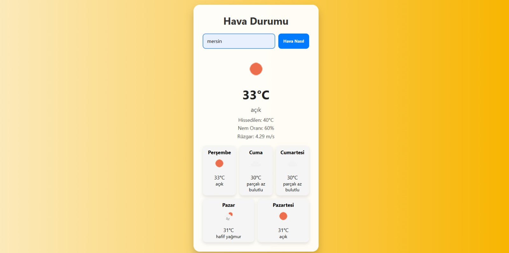

# 🌤️ Hava Durumu Uygulaması

Bu proje, OpenWeatherMap API kullanarak şehir bazlı **anlık hava durumu** ve **5 günlük hava tahminini** gösteren, kullanıcı dostu ve responsive (mobil uyumlu) bir web uygulamasıdır.

## 🔍 Özellikler

- 🔎 Şehir ismine göre anlık hava durumu sorgulama
- 📅 5 günlük detaylı hava tahmini
- 🎨 Hava durumuna göre **dinamik arka plan** değişimi
- 🌐 Responsive tasarım (mobil/tablet uyumlu)
- ⚠️ Hatalı girişlerde kullanıcıya uyarı mesajı

## 🖼️ Ekran Görüntüsü

## 🔧 Kullanılan Teknolojiler

- ✅ HTML5
- ✅ CSS3 (Flexbox, Media Queries)
- ✅ JavaScript (ES6+)
- ✅ OpenWeatherMap API

> 📸 

